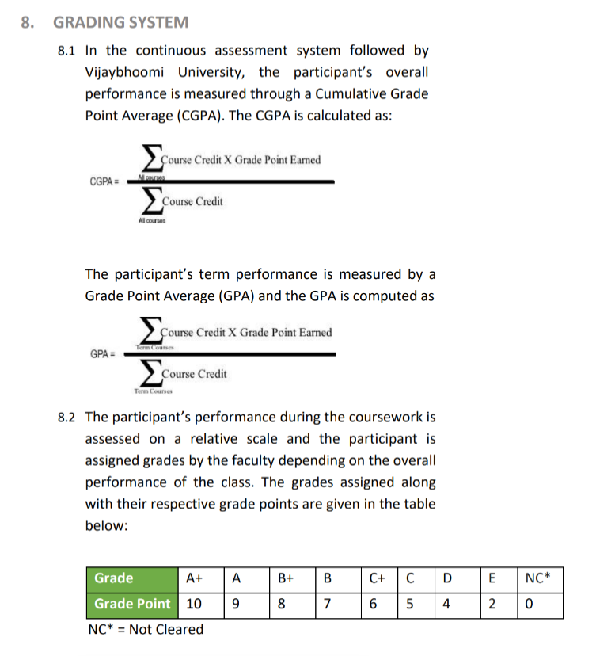
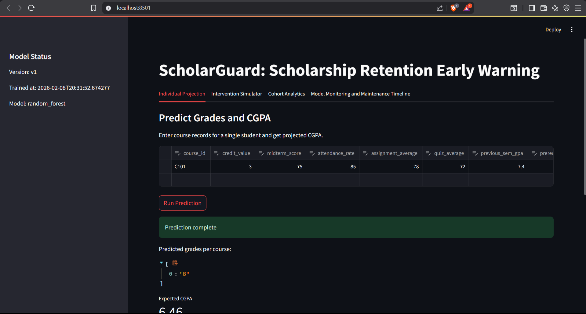
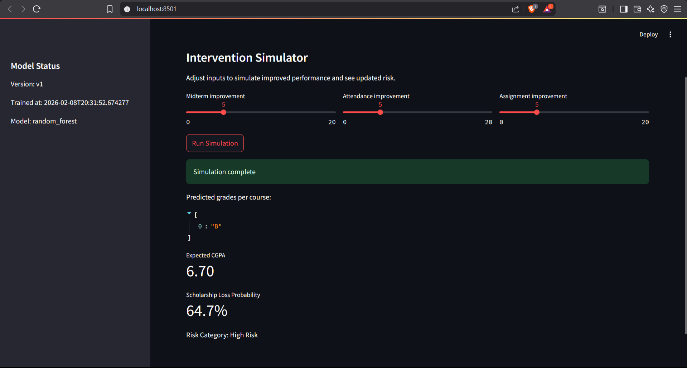
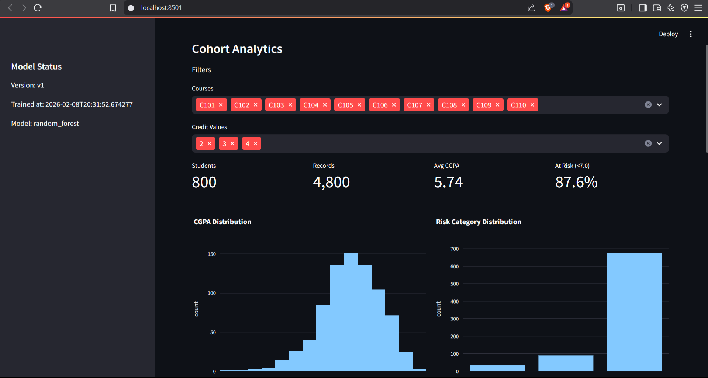
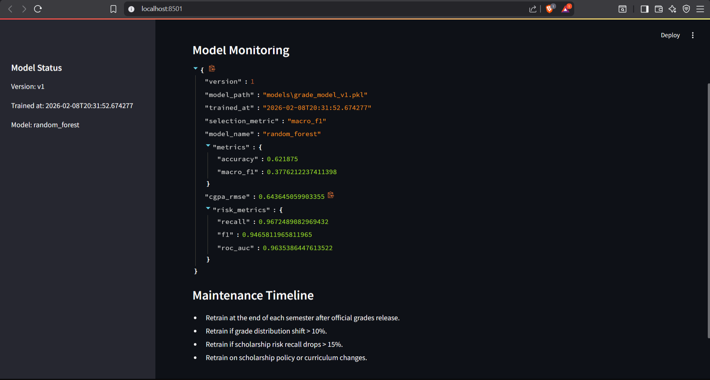

# ScholarGuard: Scholarship Retention Early Warning System

ScholarGuard is a hybrid decision-support system for early warning of scholarship risk. It predicts course-grade categories using traditional ML and then applies the official CGPA formula to determine projected scholarship risk. The system is advisory only and never automates scholarship decisions.

## Problem Statement
Students at Vijaybhoomi University must maintain a CGPA >= 7.0 to retain scholarships. Currently, eligibility is checked only at year end. ScholarGuard predicts likely grade outcomes during the term and computes projected CGPA to enable early intervention.

## Repository Structure
- data_generator/ - reproducible synthetic data generator
- src/ - feature engineering, training, evaluation, CGPA engine
- dashboard/ - Streamlit UI for analytics and prediction
- models/ - serialized models and metrics registry
- data/ - local SQLite database (not committed)

## Architecture Summary
1) Generate or ingest data into SQLite.
2) Train traditional ML models to predict course-grade categories.
3) Apply official grade-point mapping and CGPA formula to project scholarship risk.
4) Serve analytics and predictions via a dashboard.

## Tech Stack
- Python 3.11
- SQLite for SQL storage
- pandas, numpy for data handling
- scikit-learn and XGBoost for models
- Streamlit and Plotly for the dashboard

## Official CGPA formula:

$$
CGPA = \frac{\sum(\text{Course Credit} \times \text{Grade Point})}{\sum(\text{Course Credit})}
$$

## Quick Start
1) Create a virtual environment and install dependencies:
   pip install -r requirements.txt

2) Generate data (writes to data/academic.db and data/academic_records.csv):
   python data_generator/generate_academic_data.py --n-students 800 --courses-per-student 6

3) Train models and select best by macro F1:
   python -m src.train_model --db-path data/academic.db

4) Launch dashboard:
   streamlit run dashboard/app.py

5) Open the app:
   http://localhost:8501

## SQL Storage
All records are stored in SQLite at data/academic.db (table: academic_records). This satisfies the SQL storage requirement and supports periodic appends for retraining.

## Data Pipeline Notes
- The pipeline is script-based, not notebook-based, so it is production-ready and repeatable.
- CSV output is kept for auditability and quick inspection, but SQLite is the primary source of truth.
- If you want a pure SQL-only pipeline, you can disable CSV output by removing the CSV write in the generator.

## Models and Evaluation
Models trained:
- Logistic Regression (multinomial)
- Random Forest Classifier
- XGBoost Classifier

Model selection metric:
- Macro F1 on grade prediction

Additional evaluations:
- CGPA projection RMSE
- Scholarship risk recall, F1, and ROC-AUC

## Maintenance Timeline
- Retraining cadence: end of each semester after official grades release
- Retraining triggers: grade distribution shift > 10%, recall drop > 15%, policy changes
- Model versioning: models/grade_model_vX.pkl with registry in models/model_registry.json

## Dashboard
Run locally:
- streamlit run dashboard/app.py
- Open http://localhost:8501

Tabs and features:
- Individual Projection: live prediction input, projected CGPA, scholarship risk, primary drivers, suggested interventions.
- Intervention Simulator: adjust midterm, attendance, and assignment improvements to see updated grades, CGPA, and risk.
- Cohort Analytics: filters, KPIs, grade distributions, score relationships, and at risk student list.
- Model Monitoring and Maintenance Timeline: model version, metrics, and retraining guidance.

## Notes
- The pipeline is reproducible via fixed random seeds.
- Scholarship decisions remain advisory; the system provides early-warning projections only.

## Key Files
- Data generator: [data_generator/generate_academic_data.py](data_generator/generate_academic_data.py)
- Training pipeline: [src/train_model.py](src/train_model.py)
- Evaluation utilities: [src/evaluate.py](src/evaluate.py)
- CGPA engine: [src/cgpa_engine.py](src/cgpa_engine.py)
- Prediction utilities: [src/predict.py](src/predict.py)
- Dashboard app: [dashboard/app.py](dashboard/app.py)

